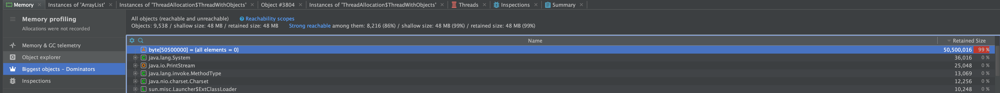
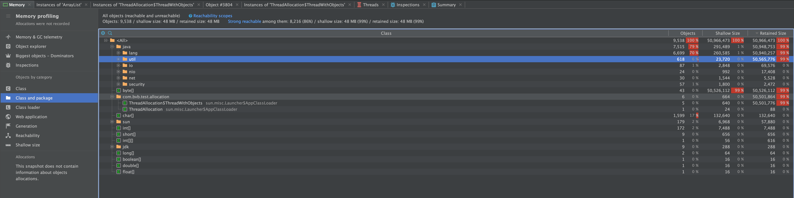
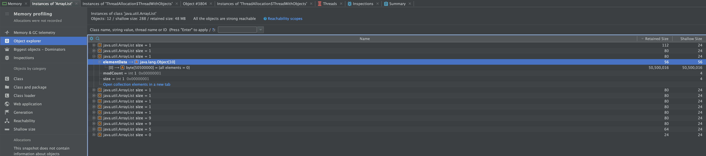
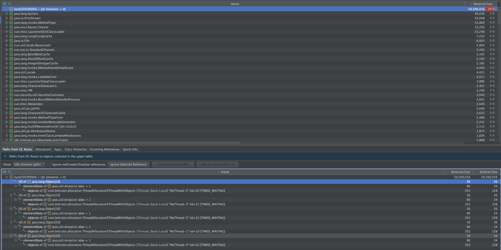

# Heap Dump Tool Analysis

In this we simplify greatly scenarios so at to work out how these tools produce their views, whether we can trust these views, and what action to take for trickier leaks.

## Scenario 01

## Scenario 02

## Scenario 03

+ In this scenario we allocate a large byte array on a Thread that then exits. A reference to this byte[] is then kept by 5 different threads as part of an `ArrayList<Object>`. We allocate ~50 MB byte array.

We then review the heap dump to see the results.

### Yourkit

+ The array is shown correctly as the dominator in the heap.

+ Class and Package view shows correctly 50MB for our target package and also the same for java.util.Arraylist

  + When we drill down from C&P view into the Arraylist objects, their retained size is small.

  + Only when we expand the object to show the reference to the large byte array do we see the values.
+ The incoming references and GC roots path work as expected

+ Because multiple references are held to the array, the value is not included under the retained size of the objects that actually have these references. As removing one of these references would not allow the GC to reclaim the object, i.e. there are 4 other references.
+ However, the views available in YourKit still provide useful information allowing us to identify the source of the allocations and the GC roots view/Incoming references allows us to view what is holding onto these objects.

### VisualVM

+ <TODO> SHow in VisualVM

## Scenario 04

+ 
