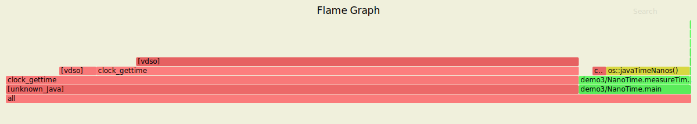

# Async profiler with Andrei Pangin

Source video: <https://www.youtube.com/watch?v=H6glyrKQlg8&list=PLNCLTEx3B8h4Yo_WvKWdLvI9mj1XpTKBr&index=1>

## Types of profiling

### Tracing

* Usually instrumentation of bytecode
* Slow and therefore cannot be used for production

### Sampling

* Periodic snapshots of what the app is doing
* Lighter weight than tracing and can be used in production
* The sampling period will control the amount of overhead
* Andrei uses it in prod for their app

## Sampling in depth

* In Java code: `Thread.getAllStackTraces()` returns a `Map<Thread, StackTraceElement[]>`
* Then there is a JVMTI method with some extra information
* 1000 threads:
  * 50ms latency
  * ~10MB results size
* Advantages are it is simple VisualVM, YourKit

## Demo 1

* VisualVM is safepoint based, therefore it shows the `Thread.currentThread().isAlive()` is where all the time is spent.
* Then he tries it with JFR and states that JMC showed nothing as it only took one sample at 10s.

## Safepoint

* HotSpot JVM stops all threads to take a thread dump but requires somewhere in the code to do this.
* Safepoints allow the JVM to take a thread dump at this point.
* Safepoints are usually at:
  * End of the method
  * Loops
* Long linear piece of code won't appear in the stack trace due to the fact that there is no safepoint to allow this to be captured.

## Native methods

* JVM has no clue when executing native method, as to whether it is sleeping or actually doing real work.
* Busy client versus idle client will show up at taking equal amount of time.
  
## Solving GetAllStackTraces problems

* Avoid SafePoint bias
* Skip idle threads
* Profile native code correctly

## AsyncGetCallTrace API

* This is an internal HotSpot API to get stack traces from current thread.
* Native code to call using signal handler, probably timer handler.
* Honest profiler and async profiler used this
* API is private and not documented.
* Compares with honest profilers against native method example above, which shows the correct values for native methods that aren't doing anything.
* Skips idle threads
* No safepoint bias
* Another JVM option required

## Important 01

* When executing with AsyncGetCallTrace you need to specify `-XX+DebugNonSafepoints -XX:+UnlockDiagnosticVMOptions` as HotSpot generates debug info only at Safepoints.
* This means that for serveral inlined methods, without this flag then you won't see the inlined methods at all.

## AsyncGetCallTrace fails

* There are bugs in teh JVM that prevent this from working each time.
* Async profiler has introduced work arounds to traverse the stack correctly in these cases, tricks as the author called them.
* See <https://bugs.openjdk.java.net/browse/JDK-8178287>

## PMU

* Starting with Pentium all chips have hardware performance monitoring.
* Hundreds of different counters in modern CPUs.
* It can be configured to generate HW interrupt when certain counter overflows.  We can use this to do profiling.
* Counters = cycles, instructions, cache misses, branch misses

## Linux PMU

* perf_event_open (peo)
* Linux syscall, subscribe  to HW/OS events
* peo also allows some profiling in hardware

## perf

* Example

```bash
perf record -F 1009 java
perf report
```

* Takes a sample 1009 times per second, the above is not a typo but uses a prime
  number rather than 1000 to avoid collision with other schedule events in the
  system.
* We don't see anything about java because perf doesn't understand Java, JIT, etc.
* We need to tell perf to understand the mapping
* perf-map-agent can collect this information to provide a mapping file for use by perf.
* It requires a specific flag to be set `-XX:+PreserveFramePointer` flag.
* perf uses FramePointers
* Each stack frame represents function or method.
* Base slot of each frame points to previous frame, therefore we can walk through collecting the stack trace.
* How to find the first frame?  The JVM frame pointer register points to this, but HotSpot uses frame pointer as regular general purpose register by default.
* This flag reverses this optimisation, which costs <5% overhead

## Flamegraph

* y-axis = stack trace, higher = deeper stack
* Length of rectangle on x-axis = total time spent in this method.
* This is sampling so wouldn't be correct to state that this is time, seen more times on sampling.
* You can search and it states at the bottom right the number matches in terms of % times seen.
* Green = Java method
* Yellow = C++ method JVM
* Red = native method
* Brown = Linux Kernel code

## Problems with perf

* Perf sees interpreter as single piece of machine code, it doesn't understand what interpreted method is being executed, therefore in his example its difficult to understand what method is using the CPU.
* Requires special agent
* Requires flag to be set
* Needs some things set on the Linux kernel level
* Perf is limited by default to 127 stack frames
* Perf profiles are very large
* 1000 threads for 60s = GB output file

# Async Profiler part 2

Video: <https://www.youtube.com/watch?v=WnRngFMBe7w&list=PLNCLTEx3B8h4Yo_WvKWdLvI9mj1XpTKBr&index=2>

## Mixed approach

+ Good to mix approach from perf_event_open for kernel, native, use HW counters and then use the AsyncGetCallTrace API for Java.
+ This is the method used in async profiler
+ The tricky part is how to merge the two stacks from both sources.

## How to use flamegraphs

+ Look for leaf flames
+ Look for long leaf flames

## Using Async profiler

* You can attach later but you should use `-XX:+UnlockDiagnosticVMOptions -XX+DebugNonSafepoints` if you intend to do that.

### Demo3

#### FileReader

* He provided a number of options for buffers to use for reading a file to provide the best IO.
* He originally went for 32M as the buffer to use, with the thinking being that we have less system calls, etc.
* In the case he tested 16M was more performant than 32M.
* The page faults in the kernel were caused by malloc using a different implementation for the size of the allocation.  In the case of 32M it involved paging but with a smaller buffer it was ok.

#### nanoTime

* Strange behavioiur of nanoTime
* When is colleague upgraded his PC, all his benchmarks became much slower.
* The reason was nanoTime was much slower on this upgrade.
* There will be no difference with a Java only profiler.
* With async you can see that there are system calls in brown.
* This is related to multiple available clock sources being in Linux.
* I found an issue when testing with J8/J11, with and without the DebugNonSafePoints setting.
* Example local execution on Linux `5.4.0-58-generic`:



* Here we see `[unknown_Java]` which is obviously the call to gettime.

Slow time on EC2 due to clock source being XEN by default, see here: <https://aws.amazon.com/premiumsupport/knowledge-center/manage-ec2-linux-clock-source/>

### Wall clock profiling

* Can start as an agent
* CPU won't always show why your startup is slow.
* The time is not always spent on CPU intensive work, may be disk IO, netIO (DB, etc), logs etc
* Wall clock profiling handles:
  * Thread.sleep
  * Object.wait / Condition.await
  * Wait to get lock/semaphore
  * Wait for IO

### Lock contention

* Special mode for lock contention

```bash
./profiler.sh -e lock -o flamegraph=total
```

* Counts the amount of time spent acquiring locks
* This applies for reentrant locks, etc
* `flamegraph=total` will then show total time in nanoseconds

PAUSED at 39:00 on the second video.

# Async Profiler part 3

<https://www.youtube.com/watch?v=bTDmpwhwy3E&list=PLNCLTEx3B8h4Yo_WvKWdLvI9mj1XpTKBr&index=3>

## How many objects created?

* Not always obvious how many objects are being created, even with simple code.
* He gives an example about timezones and alloc being out of control.
* The bug was the timezone was unknown and therefore it was creating its rules each time.

## VisualVM Sampler

* Sampler = snapshot of histogram of the objects on the heap at that point.

## Profiler

* Profiler = bytecode instrumentation, added to all places where new objects are allocated. More accurate but slower.
* They optimiste by getting sample each n times

## Dtrace/SystemTap

* One other method that worked for HotSpot is allocation probe.
* This worked in JDK8 but may not work in 
* All allocs are slower, large overhead

## Other tools

* Aprof, instrumenting profiler but very optimised; <https://github.com/devexperts/aprof>
* Allocation instrumenter, actually a framework for writing your own allocation tests. <https://github.com/google/allocation-instrumenter>

## Overhead

* They have a large overhead apart from JMC.

## JMC

* JMC has very low overhead < 5% overhead for capturing allocation.
* Now OS and backported to 8u262
* Gives you the stack trace to where the objects are allocated from.

## TLAB (Thread Local Allocation Buffer)

* If enough space in TLAB, use simple TLAB alloc
* If not enough space in TLAB, 2 options:
  * 

### Simple TLAB

* Allocation is handled here first if possible
* The allocation requires no synch
* Alloc involves simple pointer increment


## Tasks

1. Raise issue about nanotime, even when connecting directly as agent it didn't work as expected.
2. demo6 doesn't work as expected due to the classpath failure
3. Second part of the presentation doesn't seem to be there

## Questions

* Does Async profiler rely on some Linux signals?
* Async profiler works with what JVMs?
  * It works with: HotSpot, Azul (no IBM :<)
  * YourKit supports Async traces via AsyncGetCallTrace
* Can you profile specific Java threads to decrease overhead
* Do you need sudo permissions to run Profiler?
  * You don't need root to run the image